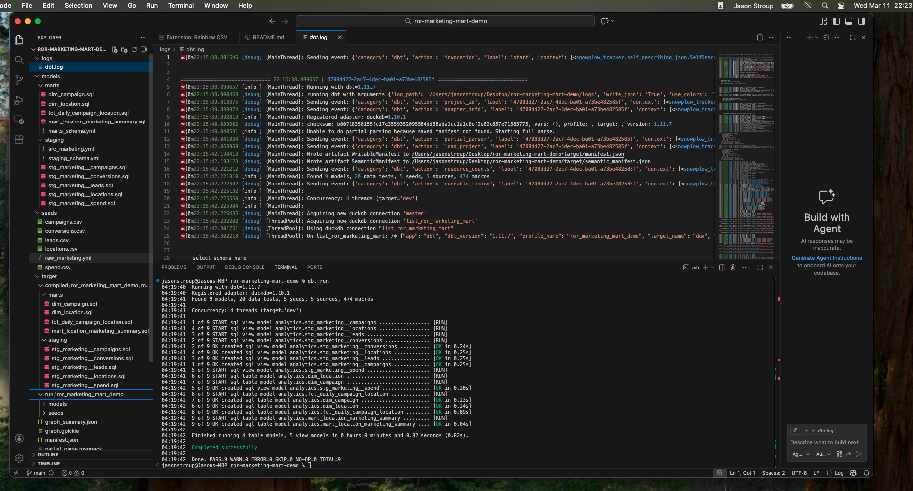
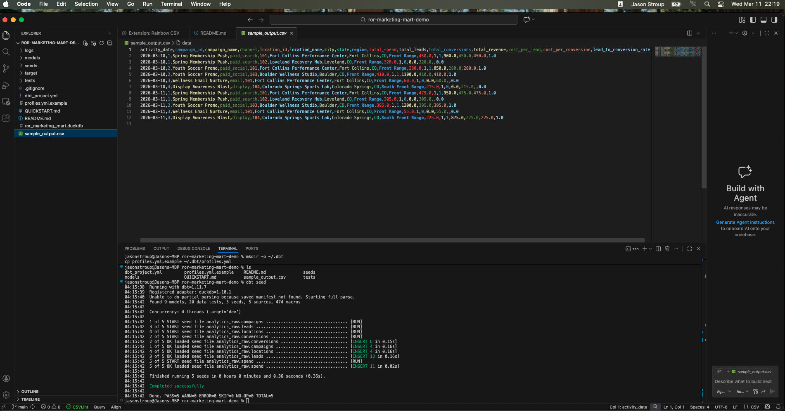
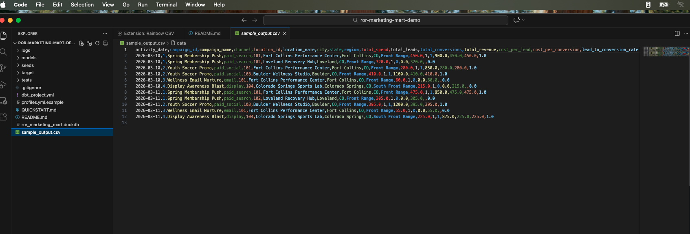

# ROR Marketing Mart Demo

A small **dbt-style marketing mart** built to mirror the shape of the ROR Data Engineer role: SQL-heavy ELT, layered transformations, dimensional modeling, data quality tests, and clean documentation.

## Why this project fits ROR

This demo models a simple **location-based marketing** workflow with raw campaign, spend, lead, and conversion data transformed into:

- staging models for cleanup and deduplication
- dimensions for campaign and location context
- a fact table at the grain of **one row per date + campaign + location**
- a final business mart for KPIs like cost per lead and conversion rate

## Business question

> How is marketing spend performing by campaign and location, and which locations are generating the best lead-to-conversion outcomes?

## Data model

### Raw sources

- `campaigns`
- `locations`
- `spend`
- `leads`
- `conversions`

### Staging

- `stg_marketing__campaigns`
- `stg_marketing__locations`
- `stg_marketing__spend`
- `stg_marketing__leads`
- `stg_marketing__conversions`

### Dimensions

- `dim_campaign`
- `dim_location`

### Fact

- `fct_daily_campaign_location`

### Business mart

- `mart_location_marketing_summary`

## Fact table grain

**One row per `activity_date + campaign_id + location_id`**

This keeps spend, leads, conversions, and revenue aligned at a reporting-friendly grain.

## KPI definitions

- `total_spend`
- `total_leads`
- `total_conversions`
- `total_revenue`
- `cost_per_lead`
- `cost_per_conversion`
- `lead_to_conversion_rate`

## Example dbt concepts used

- `source()` for raw data inputs
- `ref()` for model dependencies
- data tests for quality checks
- materializations for view/table/incremental strategy choices

## Why DuckDB for the demo

DuckDB is the fastest way to get a local dbt demo running with minimal setup.

## How to run locally

1. Create a Python environment.
2. Install dbt and DuckDB:

```bash
python -m pip install dbt-core dbt-duckdb
```

3. From the repo root, copy the example profile:

```bash
mkdir -p ~/.dbt
cp profiles.yml.example ~/.dbt/profiles.yml
```

4. Seed the raw data:

```bash
dbt seed
```

5. Run the models:

```bash
dbt run
```

6. Run the tests:

```bash
dbt test
```

7. Optionally generate docs:

```bash
dbt docs generate
```

## What this demonstrates

This project is intentionally small, but it shows the exact shape of work that matters for the role:

- clean source definitions
- layered SQL transformations
- deterministic deduping with a window function
- dimensional modeling
- data quality checks
- business-facing KPI logic
- production-minded documentation

## How I would extend this in production (features)

- add incremental models for larger lead/conversion volumes
- add source freshness checks
- add attribution logic across channels
- add geo/trade-area enrichment
- add a BI dashboard on top of the mart
- add orchestration and environment-specific deployment configs

## Sample Output

This screenshot shows the final KPI-ready mart at the grain of one row per activity date, campaign, and location.



